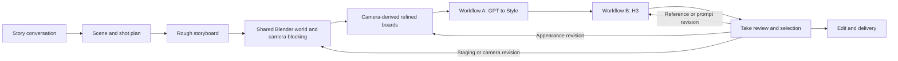

# ScrappyVibes video production — Calliope integration blueprint

Assessment: 2026-09-20. Inspected upstream commit `ee7648d9571c69f5fae7895a212a412b751c3a18` (1.5.4 release commit).

Fork: https://github.com/scrappyvibes/Calliope

Local branch: `codex/scrappyvibes-pipeline`. `origin` is the ScrappyVibes fork; `upstream` is `benjiyaya/Calliope`. The architecture below describes the target integration; the implementation checkpoint records what is actually built and verified.

## Implementation checkpoint — 2026-09-20

- Fork verified; implementation branch `codex/scrappyvibes-pipeline`. Private production media remains in ignored local data folders. Publishing this branch requires Git authentication separately from browser sign-in.
- Claude and Codex subscription adapters use authenticated local CLIs and return validated action proposals to Calliope's scoped tool harness. Calliope owns history. Live testing resumed the same saved scene across both providers; both inspected actual inline images. No API billing fallback. Claude's replacement system prompt separates proposed application calls from native CLI execution; see the story-first checkpoint for a model reliability issue exposed during testing.
- Shared production state has immutable revision receipts, optimistic conflicts, stable clip IDs, primitive geometry, start/end cameras, source hashes and explicit rough/refined/styled/video selections. Geometry/camera edits mark only dependent outputs stale. Earlier takes remain accessible.
- Blender runs a trusted data-driven builder locally, with bounded CPU rendering, queue coordination, cancellation and retained `.blend`, PNGs and 24-fps MP4. Project 2 proves a moving camera; project 3 proves two cameras in one world and a rough-board image packed into the camera background. Scale factors refer to Blender's two-meter base primitives, not full dimensions.
- Workflow A is adapted from the supplied source, removing API chat while retaining the image recipe and explicit prompt/seed bindings. Workflow 1/job 4 completed, with a selected styled image retaining the inspected bench/traveler composition. Project 2 used an externally generated refinement; project 3 now also proves native camera-derived refinement (job 10) followed by styling (job 12).
- Workflow B is resolved through the installed Comfy frontend and adapted with explicit H3 image/video/audio references, prompt, seed and frame-grid duration. Workflow 2/job 5 completed both native and RTX branches: 124 frames at 24 fps, 5.167 seconds. Actual playback showed preserved appearance but a cropped head at the end; this is a proof take requiring creative revision.
- Image/video jobs freeze graphs and reference hashes before queueing. Durable submission receipts reconcile original prompt IDs after uncertainty without blind resubmission. Cancellation targets owned pending entries and never globally interrupts Comfy. Mock recovery tests pass; a live mid-render restart remains unverified.
- The Previs UI exposes cameras, board lineage, candidate inspection/selection, H3 prompting/reference binding and loading a prior attempt for revision. Selected video paths feed existing clip editing/export. Restart retained project 2's selected proof take and exact file hash.
- Fresh story-first project 3 saved beats, a character/location, a scene and two clips through chat, then generated a rough board with workflow 3/job 6. Real image inspection led to shared geometry and two Blender renders (jobs 7/8). The rough frame is frontal rather than the initially requested high three-quarter view. Geometry remains a crude blockout; no finished visual approval is claimed.
- Validation: **621 backend tests passed** in the latest full run. Frontend check: zero errors/seven existing warnings; production build passed. A revised H3 take and live render recovery are now verified below. Two-shot visual continuity and final edit/export remain in progress.
- Local app: backend `127.0.0.1:8247`, frontend `127.0.0.1:5173`. Claude mode is configured. Check current sessions/jobs before restarting; process handles are operational state, not stable configuration. The repository root `.venv/` is the current Python runtime. Use `C:/Program Files/nodejs/npm.cmd` because the roaming shim is broken.

The complete production pipeline remains in progress. The checkpoints below distinguish verified execution from outstanding visual and recovery acceptance.
## Product

One project workspace where the captain and a Codex or Claude agent can develop a story, approve a shot plan, inspect rough boards, revise a shared Blender world and its cameras, refine the resulting views, stylize those images, and generate/review H3 takes. Every shot retains its identity and revision history throughout.

The rough storyboard expresses intent; Blender establishes repeatable geometry. A refined board has a recorded source camera/frame and approved identity/look references. Styling is a separate versioned operation. Blender is the spatial authority even when the final generator uses only painted image references.

The interface should show a persistent conversation beside the current stage, a shot strip, reference assignments, and selected/candidate takes. A camera change marks dependent boards and takes stale; it does not delete them. Users can compare the blockout, refined board, styled board, and video for the same shot.

## What Calliope provides

| Existing seam | Evidence in this checkout | Integration decision |
|---|---|---|
| FastAPI, SQLite, SvelteKit | `calliope-backend/src/calliope/main.py`, `db.py`; `calliope-web/src/routes/` | Retain the app foundation and migration compatibility. |
| Project, story, character, location, scene and clip records | `db.py` | Extend clips with durable shot identity and revision relationships. Avoid a second unrelated shot list. |
| Session-linked chat, tool registry and event stream | `agent/harness/registry.py`, `runner.py`, `loop.py`; `routers/agent.py` | Reuse project scoping and tool executors behind provider adapters. |
| Comfy API workflow import and tagged input discovery | `comfyui/parser.py`, `patcher.py`, `registry.py` | Add explicit workflow manifests and field bindings for these graphs. |
| H3 prompt preview and a six-section reference profile | `comfyui/profiles.py`, `agent/prompts.py`; project Video UI | Keep preview/drafts; make prompt generation use the actual reference manifest and chosen provider. |
| Render jobs and exports | `queue/worker.py`, `queue/manager.py`, `export/runner.py` | Retain UI/events, strengthen execution receipts and recovery before live production. |
| Three.js Build Scene | `routers/shots.py`, `agent/harness/plugins/shot_builder.py`; `routes/build-scene/` | Useful rough blocking UI, but not a Blender integration. Its current sandbox-only composition model must be linked to project shots. |

Build Scene currently makes camera framing a user operation, scopes its agent to `shot_*` tools, and exports browser-rendered captures. It does not supply a shared `.blend` world or the requested agent-directed Blender camera pipeline.

## Supplied workflows: observed facts

Originals remain at their supplied local paths. Embedded prompts, notes and instructions were inspected as workflow data, not adopted as instructions for this task. No generation was queued.

### A — GPT to Style

Source: `X:/YouTube/ComfyWorkflows/GPT to Style.json`

SHA-256: `091afcee4aefcc74c50e7a3168bd27c4e7e82db0ed467dfc48160181b57b070e`

- API-format graph, 33 nodes. Calliope's actual parser discovers **zero tagged inputs and zero tagged outputs**.
- Node `414` loads the existing raw image. This workflow does not itself create the initial GPT image.
- `419` / `420` / `421` provide style prepend, Krea2 prompt and style append; `422` concatenates them into encoder `51`.
- Sampler `78` performs image-to-image at denoise `0.25`, with the input encoded by `415`.
- A second image-to-image stage uses sampler `386` at denoise `0.1`, checkpoint `387`, prompt encoder `389`, and save node `392`.
- Nodes `404` and `418` are `ClaudeAPIChat`; `405` and `417` are key providers. Their literal key fields were empty at inspection. Subscription-backed chat does not automatically replace these API calls.
- Node `79` is `Seed (rgthree)`. Calliope's generic patcher defaults this class to field `value`, while the graph needs `seed`: tagging alone is insufficient.
- Includes VRAM debug/unload nodes and color correction. Preserve the approved look, but inspect shared-GPU effects before enabling live queueing.

Proposed adapter: accept a refined image, authored Krea prompt, second-pass prompt, style preset and seed. Give inputs explicit node-and-field mappings. Offer a subscription mode that obtains prompt text through the selected agent runtime and binds it directly, eliminating the render graph's API-chat dependencies in a derived variant. Keep the original graph intact and retain a separate explicit API-backed mode if desired. Verify the two variants visually before claiming equivalent appearance.

### B — SV_H3_VideoProduction_920

Source: `X:/YouTube/ComfyWorkflows/SV_H3_VideoProduction_920.json`

SHA-256: `12d1df112cf734dc2ff97f12e79dec53accc706c2109ebfd0d6c765317eecf83`

- Comfy editor-format graph, **98 nodes**, with Set/Get wiring, bypassed reference loaders and an rgthree group bypasser. Calliope's API parser discovers **zero inputs and zero outputs**.
- Core conditioning is node `265`, `MiniMaxH3ReferenceToVideo`, exposing nine image, three video and three audio reference sockets, plus reference-video audio.
- Prompt comes from Textbox `334`; duration from `259`; resolution from selector `252`; seed from RandomNoise `256`.
- Expression `250` rounds the requested 24-fps duration up to H3's `17k+5` frame grid. The saved ten-second value yields 243 frames, or 10.125 seconds. Editorial duration must be tracked independently.
- Sampler `332` is `MiniMaxH3DualClockSamplerT8`; saved settings are eight steps, shifts 12/3, `dual_clock_euler`, `beta`. This differs from older local turbo recipes; do not substitute them.
- Outputs include video-combine nodes `264` and `339`, both configured for 24-fps H.264 MP4, with an RTX super-resolution branch. Identify base versus enhanced output from graph links before selecting a delivery asset.
- Several image loaders are active; others and the supplied video/audio loaders are bypassed. Socket capacity is not the same as an enabled reference assignment.

Proposed adapter: use Comfy's installed frontend/node definitions to obtain a resolved API export, preserving Set/Get resolution, bypass state, dynamic sockets and custom widgets. Retain the editor graph for reopening. Validate node classes and model availability against the running installation. Do not infer a runnable graph merely by matching widget positions.

Store an ordered reference manifest with media ID/hash, kind, socket, prompt label, and intended authority (identity, appearance, composition, movement, sound). Compile labels from actual bindings. Do not let filename sorting or numeric node order silently decide identity.

A video reference on Ref2VA is conditioning, not an exact continuation prefix. Calliope's current presence-of-video-input continuation check is too weak for this graph. Require an explicit workflow capability before enabling continuation; authored cuts default to independent generation.

## Subscription-backed agents

Upstream Calliope's `LLMClient` speaks OpenAI-compatible chat HTTP and resolves API profiles by role. A ChatGPT or Claude subscription is not a drop-in API key for that client.

Implement a provider session boundary with start/resume, streamed events, tool execution, steering, cancellation and authentication/usage status. Map a Calliope session to its provider session ID. The selected runtime owns its agent loop; Calliope exposes domain tools through its existing guarded executors. Avoid nesting Calliope's completion loop around another full agent loop.

- **Codex:** use the local app-server protocol with managed ChatGPT sign-in. Use an MCP tool bridge as the stable integration surface; dynamic tools are also documented but experimental, so pin/test the protocol if selecting them. Credentials remain managed by Codex. [App-server documentation](https://learn.chatgpt.com/docs/app-server), [authentication](https://learn.chatgpt.com/docs/auth).
- **Claude:** use Claude Agent SDK / Claude Code non-interactive sessions and supported session resumption with the user's existing sign-in. Anthropic's current June 15 update says these uses still draw from subscription limits; detect actual account availability and limits at runtime. [Current subscription guidance](https://support.claude.com/en/articles/15036540-use-the-claude-agent-sdk-with-your-claude-plan).
- Preserve API/local-model profiles as an explicit alternative. Never silently fall back from subscription to paid API calls.

All story, shot, image-prompt and H3-rewrite paths must use the provider boundary. Changing only the visible chat would leave hidden API dependencies. Provider switching creates or resumes that provider's session using the saved production state; raw internal conversation state need not be portable.

Both CLI executables and subscriptions are verified. The implemented adapter uses isolated CLI completions with Calliope-owned history and scoped tool execution. This avoids duplicating the existing harness with a second native agent loop. Codex and Claude can both inspect inline images and continue the same saved project conversation; see the checkpoint for actual evidence. App-server/MCP remains an alternative architecture, not a required dependency of the current implementation.

The parent Studio already has a Claude SDK runtime at `Studio/src/lib/server/runtime/claude.ts`, including streaming, session resumption, cancellation, sanitized environment and a tool-scope hook. Use it as an implementation reference for the provider boundary; do not transplant its album/department-specific scopes into film production.

## Reuse the local Blender production work

Existing integration points in the parent workspace:

- `MusicVideoFactory/previs/cli.py`: validate, build shared scene, render stills or a shot; uses background Blender Python.
- `MusicVideoFactory/previs/project.py`: project loading and source hashes.
- `MusicVideoFactory/previs/resources.py`: Comfy queue/GPU observation and idle waiting.
- `MusicVideoFactory/previs/media.py`: clips, animatic and review media.
- `MusicVideoFactory/previs/h3.py`: submission receipts and resume behavior worth adapting, not a replacement for workflow B.
- `MusicVideoFactory/previs/README.md`: tested commands and constraints.

Wrap these capabilities in queued jobs with progress and output receipts. Generalize the existing project schema rather than assuming every story is the example's motorcycle journey or requires album-loop endpoints. A world may use a project-specific builder. Define coordinates, units, FPS, object IDs, camera lens/transforms, and shot frame ranges explicitly at the Three.js-to-Blender boundary.

Keep film production source and media under a production project folder; link the existing album/vault sources instead of copying their canonical content into new album files. Proposed production JSON owns authored shot/world/reference revisions; SQLite indexes these and stores runtime sessions/jobs. Implement one write-through service so the UI and tools cannot create conflicting sources of truth. Keep repository code and public templates separate from private production artifacts.

## Durable render execution checkpoint

The queue now persists an attempt UUID, original server/client identity, requested and returned prompt ID, exact prepared graph and SHA-256 before submission. Submission intent is claimed atomically. A lost response, timeout or restart reconciles the named history, owned queue entries and bounded recent history; missing history never authorizes a duplicate POST. Explicit server rejection or a recorded execution failure allows a fresh attempt on user retry. Output files are retained by job/attempt, with distinct filenames for each output.

Cancellation deletes only the named pending prompt on its original server. It never invokes ComfyUI's global interrupt. Already running renders may finish, and the UI says so. Cancelled jobs cannot be overwritten by late completion/failure. Legacy running jobs without ownership receipts require inspection rather than automatic restart. Queue claims use a SQLite writer transaction.

Mock-transport tests cover response loss, server-assigned IDs, missing history, cancellation scope/server pinning, late completion and legacy restart. The initial affected queue/export regression run passed 49 tests. No actual Comfy render has been submitted to prove recovery yet.

## Remaining execution changes

The upstream worker kept `prompt_id` only in the running function and called global interrupt. The receipt implementation above replaces those paths. GPU scheduling, reference-content receipts and end-to-end visual proof remain outstanding.

Next implementation evidence: the main installation's local `server.py` accepts a caller-supplied UUID `prompt_id` on `/prompt` and a targeted `prompt_id` body on `/interrupt`. It does not deduplicate repeated prompt submissions. Verify the running service/capabilities before relying on these features; persist the attempt before submission and reconcile queue/history instead of blindly retrying. Blender is installed under `C:/Program Files/Blender Foundation/Blender 5.2` and is not on PATH.

Before sharing the captain's main Comfy instance:

1. Persist an attempt ID, graph/reference hashes, Comfy client ID and returned prompt ID. Record the attempt before submission; reconcile an uncertain response with queue/history.
2. Resume observation of the existing prompt on restart. Treat polling timeouts as unknown/awaiting reconciliation, not permission to resubmit.
3. Delete only owned pending queue entries; interrupt only when the active prompt's ownership is established. Never cancel an unrelated render.
4. Schedule Blender and Comfy GPU work with the existing resource observer. Do not start alternate Comfy installations.
5. Save exact compiled prompt, graph, reference bindings, seeds, outputs and take selection. A successful queue result is execution evidence, not visual approval.

## Build order and acceptance

| Milestone | Deliverable | Acceptance evidence |
|---|---|---|
| 1. Agent connection | Provider adapters and project tool bridge | Resume a saved Calliope conversation across Codex and Claude; each edits the same persisted scene/shot plan through scoped tools, with no API key for those turns. |
| 2. Production state | Stable shots, versioned boards/references and stage UI | Change one camera; only dependent outputs become stale; prior takes and accepted revisions remain accessible after restart. |
| 3. Blender bridge | Shared `.blend`, camera views and animatic | Two views of the same world preserve object IDs/geometry; shot revision rebuilds the intended views; inspect actual moving previs. |
| 4. Refined boards and A | Camera-derived boards, bound style adapter | Preserve framing/identity in an inspected styled image; prove explicit seed and both prompt bindings; no hidden API chat in subscription mode. |
| 5. H3 B | Resolved API graph, reference manifest and durable queue | One real short clip; exact labels/socket bindings, 24-fps/grid correctness; restart observes the same prompt ID; cancellation leaves unrelated jobs alone. |
| 6. Review and edit | Compare takes, select ranges, export | Assemble two accepted shots with explicit cut/transition choices and frame ranges; reopen the project and recover every selected source. |

The first complete proof should be a small two-shot scene. Run the whole chain, revise one camera and one H3 take, then restart and resume. This tests the integration before scaling to a full film.

## Verification completed in this assessment

- Public fork visibly verified as forked from `benjiyaya/Calliope`; fetched its `main` branch locally.
- Read implementation seams, not only README claims.
- Parsed both supplied JSON files and ran Calliope's actual input/output discovery functions against them: 0/0 for both.
- Exercised its patcher with seed node `79`: the requested seed was written to an unused `value` field while the real `seed` stayed unchanged, confirming the field-binding gap.
- Checked workflow classes, reference capacity, bypass states, denoise values, duration expression and sampler settings without executing the graphs.
- Compared the requested Blender path with existing production code and documentation.
- The workspace's existing graph contains no matching Blender/previs/restyle/review-room labels; direct source inspection supplied those findings. Graphify CLI query stalled and was stopped; no new knowledge graph is claimed.

Still unverified: two-shot character/scene continuity and final visual fidelity. Workflow A, Blender stills/moving previs, external refined-board import, a selected styled take and H3 execution are verified as recorded in the checkpoints below. The complete integrated interface remains in progress.

## Workflow B adapter checkpoint

Exported the original workflow through the installed main ComfyUI frontend, resolving Set/Get, reroutes and bypasses into 26 executable nodes. A private editor copy enabled all reference loaders (without enabling the bypassed LoRA) and supplied an authoritative export of all nine image, three video and three audio sockets. Source files remain unchanged; both API exports live in ignored `calliope-backend/data/workflow-adapters/`.

The version-checked H3 adapter retains chosen contiguous reference sockets, prunes unused loaders, clears sample media/prompt text, and binds prompt, duration, seed and each reference explicitly. Models, LoRAs, sampler parameters, resolution selector, frame-grid expression, native output and RTX output are preserved. Video loaders explicitly use 24 fps and `format=None`, replacing the source's AnimateDiff loader preset. Video audio outputs remain disconnected, matching the source wiring.

The workflow importer now exposes H3 reference counts with 9/3/3 limits and a combined cap of 12. Browser verification registered workflow 2, **ScrappyVibes — H3 styled board + Blender motion**, with five inputs (Picture 1, Video 1, prompt, duration, seed), two outputs and 24 nodes. All classes and non-media enum values match the running main ComfyUI's `object_info`; no H3 render has been submitted. This is compatibility evidence, not proof of successful execution or visual quality.

Validation: 14 style/H3 adapter tests passed; frontend check returned zero errors and seven existing warnings; production frontend build passed. Tests cover recipe preservation, slot pruning, exact socket labels, media limits, missing bypassed references, dangling links, and a preparation-only API endpoint. The test fixture is the frontend's resolved graph with example prompt/media names replaced by neutral values.

## Shot-level H3 execution checkpoint

Shot-level generation now exists in the Previs stage and as `generate_production_video` for either subscription provider. The service binds Picture 1 to a current styled board and Video 1 to the same shot's completed current Blender motion job. Additional references must be existing project assets. It validates reference media, prompt labels, duration and seed; pins graph, prompt, source revision and content hashes; and records requested versus actual frame-grid duration. Finished candidates never automatically replace selected clips.

Job 5 is a real completed render from the UI, with workflow 2, styled board `f1110ba4-5590-464c-80eb-c061d27bfa8f`, Blender motion job 3 and seed 20260920. Attempt `8f057631-c3af-40ac-aac0-50b1e2b1371a` submitted Comfy prompt `c4a2d79a-2e20-4ba6-9c73-95952c131214` once and recorded completed history. Both output branches succeeded:

- `data/assets/2/video/5/8f057631-c3af-40ac-aac0-50b1e2b1371a/000-PM_H3_UltraSpeed_00035-audio.mp4`: 1360×768.
- Same directory, `001-PM_H3_UltraSpeed+RTXSR_00024-audio.mp4`: 5440×3072.
- Both: 124 video frames, 24 fps, 5.166667 seconds, with generated audio.

Inspected start/middle/end frames and played the native video in Calliope through its end. The illustrated appearance survives the forward/lowering camera movement; the final composition crops the traveler's head and needs revision. This proves execution and review, not finished creative quality or pixel-exact camera matching. The native output is selected **in the proof project only** as take `5:0`, production revision 9, to exercise editing/export integration.

`select_production_video` and the UI selection button retain earlier takes, reject stale camera/world outputs, record file hashes and project selected paths onto existing clips for editing/export. Canonical selection reload repairs a missing database projection. The UI exposes recorded prompts/references and can reload an attempt's settings for a separate revision.

Restart evidence: after stopping and restarting the backend, production revision 9 still selects `5:0`, its video bytes match the stored SHA-256, and the UI shows Selected take. Revise this attempt restored the recorded seed 20260920, requested five seconds, selected board, Blender job 3 and prompt into the form without submitting another job.

Validation: full backend suite **607 passed** (311 seconds); frontend check has zero errors and seven existing warnings; production frontend build passed. Still to prove: revised camera/video, two-shot continuity/edit/export, and a fresh story-first chain through rough boards. The complete pipeline remains local and uncommitted.

## Story-first integration checkpoint

Added separate rough-board (text-to-image) and refined-board (Blender image-to-image) presets using workflow A's installed Krea model/encoder/VAE names. The neutral sampler follows the installed Comfy core Krea blueprint: eight Euler steps, CFG 1, simple scheduling. Rough defaults to 1024×576; refinement exposes denoise and new imports now default to 0.5 after the visual test below. These are new presets, not changes to workflow A. Registered locally as workflows 3 and 4; existing imports retain their saved defaults.

Shots can link a rough board. Previs validates its stored hash, freezes it in the job snapshot, rechecks the bytes before Blender execution, and packs the image into the `.blend` as that camera's background reference. Geometry remains explicitly authored; no image-to-3D reconstruction is claimed. Shots without references keep their previous source hashes. The UI camera form exposes this link.

The agent now has `inspect_production_image`, restricted to a project board or a completed project job's image. It sends the actual bounded image bytes through the selected Codex/Claude subscription and returns observations with the file hash; it rejects unrelated paths/IDs and never silently falls back to a text-only API. `get_production_workflow` exposes exact input bindings before generation.

A fresh live chat test in project 3, **Story-first proof - A moment before leaving**, session 3, uncovered two gaps: production tools were absent from the old role allowlists, and one subscription completion invented native-tool failures instead of proposing application calls. Added a dedicated `production` role with the complete pipeline, explicit planner ownership for scene/clip creation under `script`, and clearer subscription-envelope instructions distinguishing remote application capabilities from intentionally disabled native CLI tools.

The resumed chat really saved scene 2 and clips 3/4, after previously saving two beats, Traveler character 1 and Station Platform location 1. It then used the production role to discover workflow 3's bindings and enqueue job 6 for clip 3. Job 6 completed: `data/assets/3/image/6/08620d1c-83b9-409f-83af-b7553fa5f089/000-Calliope_rough_00001_.png`, 1024×576, seed 20260921. Visual inspection shows a full-body traveler in the correct wardrobe by a bench under a station canopy, but frontal rather than the requested high three-quarter framing. It is a rough planning candidate, not a finished approved image.

Session 3 saved rough candidate `c9fdd72c-e34b-48d7-a1bc-0cbc7939168a`, linked it to camera 3, authored a shared station blockout and rendered both cameras as job 7. Reopening `world.blend` with Blender confirmed the camera background image is packed into the file. Actual image inspection correctly identified the rough board's frontal composition. The first blockout exposed a scale misunderstanding: Blender's primitives have two-meter unscaled bounds. The object schema now states scale semantics explicitly. A real chat correction produced revision 6 and job 8, improving head/torso separation; it did not yet add the requested separate limbs or bench back. Both views were visually inspected and retain the same world. Shot 4 crops the lower body, while the head remains in frame.

Claude again fabricated tool failures without issuing application calls during one correction attempt. In addition to the envelope instructions, its CLI now receives a replacement system prompt defining its role as Calliope's completion model, requiring proposed calls in the response and forbidding simulated tool results. The subsequent turn issued recorded reads, a world update, a render and image inspection. This is improved live evidence, not a guarantee against model errors. Before any runtime restart or continuation, check `/api/agent/sessions/3` and its jobs to avoid interrupting or duplicating work.

Camera-derived refinement is now proven. Job 9 used Blender job 8/shot 3/frame 1 with seed 20260922 and denoise 0.75: it produced a readable illustration but enlarged the traveler/bench and lost headroom. Job 10 kept the same seed/prompt/source at denoise 0.5 and retained much more of the original composition. Both actual images were inspected. Added optional `compare_to` to image inspection; it validates both project-owned sources and supplies both images through the subscription, returning both hashes. The live agent comparison acknowledged minor bench-width and material drift. It saved/selected job 10 as refined board `0fef78b5-f809-47ee-b6c9-65d7183fb477`, then queued workflow A job 12. Job 12 completed and was visually inspected: centered full-body character, headroom, bench and posts survived, with source-style rendering and simplified facial detail.

Locked-camera previs now renders one frame per shot and copies it into the complete frame sequence; moving cameras still render every frame. This is valid for the current static-object world schema and must change if object animation is added. Deliberately cancelled owned job 11, which was retracing identical frames. Replacement job 13 completed both five-second references in 12 seconds, retaining the shared blend, complete PNG sequences and MP4s. No unrelated Comfy job was interrupted.

Current-change validation: full backend suite **617 passed** in 312 seconds before the final comparison/optimization additions; subsequent checks passed 34 subscription/inspection/role/preset tests, 30 production/adapter/inspection/render tests and seven previs tests. Changed production/adapter/subscription modules pass Ruff. Frontend check remains zero errors/seven existing warnings and build passes. Second-view character continuity, revised H3 output, live mid-render recovery and the complete two-shot edit remain unverified. Session 3 is continuing with selection of styled job 12 and refinement of clip 4; check its live status before further work.

## Story-first H3 and restart proof

Project 3 job 15 used selected styled board `b087a462-cf39-428c-9eb5-0e854c13b3c0`, camera-reference job 13, seed 20260923 and a six-section Ref2VA prompt preserving full-body framing. The backend was stopped while Comfy explicitly reported prompt `22096549-eb2c-4dc4-a7ce-4f901ef4d578` running. On restart it resumed observation of that prompt. Job 15 completed; the database contains exactly one attempt (`31445ddf-8247-4cc3-a066-84f734d1d78b`) and its state is completed. Both native and RTX outputs exist. The native output is 1360×768, 124 frames at 24 fps, 5.166667 seconds. Opening/middle/end frames were inspected and native playback reached its end in Calliope. Head and shoes stay visible, the bench/posts remain stable and the character performs subtle movement. Selected native take `15:0` for the proof project; this is not a claim of finished release artwork.

The second camera's first refinement (job 14, denoise 0.5) widened the framing. Job 16 (0.35 with explicit camera composition) retained the closer crop, receding bench and left post better, but interpreted the traveler as facing away. This remains a visible interpretation difference. Session 3 is saving/selecting that refinement and queueing its workflow A pass; inspect actual current state before continuing.

Added `get_production_job`: compact, project-scoped status, exact generation lineage and paginated output indices, omitting the large workflow graph that caused the generic job result to truncate. Its tests cover graph omission, preservation of lineage, pagination and cross-project rejection. Latest full backend run: 621 passed in 303 seconds.